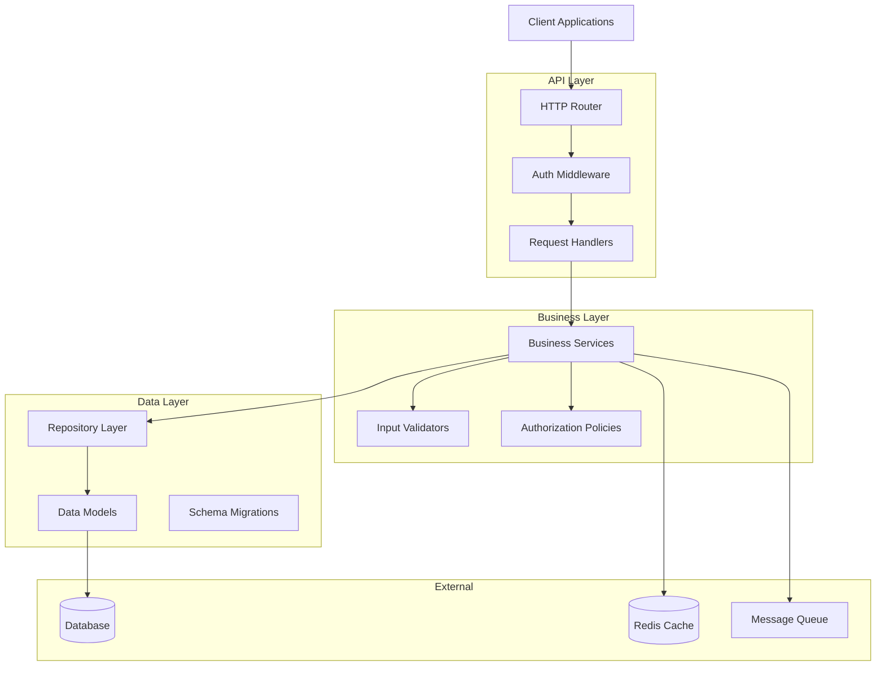

# Architecture: System Overview

This document defines the high-level architecture and design principles for [Your Project Name], establishing the foundation for all technical decisions and implementation patterns.

## Architecture Overview

The system follows a layered architecture pattern with clear separation of concerns and dependency injection throughout. The design prioritizes maintainability, testability, and scalability while maintaining simplicity where possible.



## Architectural Layers

### API Layer (Presentation)
**Purpose**: Handle HTTP requests, routing, and response formatting
**Components**: 
- HTTP router with middleware chain
- Authentication and authorization middleware
- Request/response handlers
- Input validation and sanitization

**Example Structure** (Go):
```go
type Handler struct {
    userService UserService
    logger      Logger
}

func (h *Handler) CreateUser(w http.ResponseWriter, r *http.Request) {
    var req CreateUserRequest
    if err := json.NewDecoder(r.Body).Decode(&req); err != nil {
        h.writeError(w, ErrInvalidRequest)
        return
    }
    
    user, err := h.userService.CreateUser(r.Context(), req)
    if err != nil {
        h.writeError(w, err)
        return
    }
    
    h.writeJSON(w, user)
}
```

### Business Layer (Application)
**Purpose**: Implement business logic, orchestrate operations, and enforce policies
**Components**:
- Service interfaces and implementations
- Business rule validation
- Cross-cutting concerns (logging, metrics)
- Authorization policies

**Example Structure** (Go):
```go
type UserService interface {
    CreateUser(ctx context.Context, req CreateUserRequest) (*User, error)
    GetUser(ctx context.Context, userID string) (*User, error)
}

type userService struct {
    repo      UserRepository
    validator Validator
    logger    Logger
}

func (s *userService) CreateUser(ctx context.Context, req CreateUserRequest) (*User, error) {
    if err := s.validator.Validate(req); err != nil {
        return nil, err
    }
    
    user := &User{
        Email:     req.Email,
        CreatedAt: time.Now(),
    }
    
    return s.repo.Create(ctx, user)
}
```

### Data Layer (Infrastructure)
**Purpose**: Handle data persistence, caching, and external integrations
**Components**:
- Repository pattern implementations
- Data models and schemas
- Database connection management
- Caching strategies

**Example Structure** (Go):
```go
type UserRepository interface {
    Create(ctx context.Context, user *User) (*User, error)
    GetByID(ctx context.Context, id string) (*User, error)
    GetByEmail(ctx context.Context, email string) (*User, error)
}

type pgUserRepository struct {
    db *sql.DB
}

func (r *pgUserRepository) Create(ctx context.Context, user *User) (*User, error) {
    query := `INSERT INTO users (email, created_at) VALUES ($1, $2) RETURNING id`
    err := r.db.QueryRowContext(ctx, query, user.Email, user.CreatedAt).Scan(&user.ID)
    return user, err
}
```

## Core Design Principles

### Dependency Injection
All dependencies are injected through constructors or interfaces, enabling testability and loose coupling.

```go
// Service constructor with injected dependencies
func NewUserService(repo UserRepository, validator Validator, logger Logger) UserService {
    return &userService{
        repo:      repo,
        validator: validator,
        logger:    logger,
    }
}
```

### Interface-Based Design
Services depend on interfaces, not concrete implementations, allowing for easy testing and implementation swapping.

### Error Handling Strategy
Structured error handling with domain-specific error types and consistent error responses.

```go
type DomainError struct {
    Code    string `json:"code"`
    Message string `json:"message"`
    Details map[string]interface{} `json:"details,omitempty"`
}

var (
    ErrUserNotFound    = &DomainError{Code: "USER_NOT_FOUND", Message: "User not found"}
    ErrInvalidEmail    = &DomainError{Code: "INVALID_EMAIL", Message: "Invalid email format"}
    ErrDuplicateEmail  = &DomainError{Code: "DUPLICATE_EMAIL", Message: "Email already exists"}
)
```

## Decision History & Trade-offs

### Layered Architecture Choice
**Decision**: Use layered architecture instead of hexagonal or clean architecture
**Rationale**: 
- Simpler to understand and implement for team skill level
- Sufficient separation of concerns for current complexity
- Easier to evolve incrementally compared to more complex patterns

**Trade-offs**: 
- Less flexible for complex domain logic compared to domain-driven design
- Potential for layer violations without strict enforcement
- May require refactoring as business complexity grows

### Repository Pattern
**Decision**: Implement repository pattern for data access
**Rationale**:
- Abstracts database implementation details from business logic
- Enables comprehensive testing with mock implementations  
- Provides consistent interface for data operations
- Supports multiple storage backends if needed

**Trade-offs**:
- Additional abstraction layer increases code complexity
- May lead to leaky abstractions for complex queries
- Performance overhead compared to direct database access

### Dependency Injection Strategy
**Decision**: Manual dependency injection instead of DI container
**Rationale**:
- Explicit dependencies make code easier to understand
- Simpler debugging and testing setup
- No magic or hidden dependencies
- Reduced external dependencies

**Trade-offs**:
- More boilerplate for wiring dependencies
- Potential for constructor parameter explosion
- Manual management of object lifecycles

## Performance Considerations

### Database Access Patterns
- Use prepared statements for repeated queries
- Implement connection pooling with appropriate limits
- Consider read replicas for read-heavy workloads
- Cache frequently accessed data with TTL strategies

### Concurrency Model
- Leverage language-native concurrency patterns (goroutines in Go)
- Use context for request cancellation and timeouts
- Implement circuit breakers for external service calls
- Design for horizontal scaling from the start

### Memory Management
- Use object pooling for frequently allocated objects
- Implement streaming for large data processing
- Monitor garbage collection patterns and optimize hotpaths
- Set appropriate resource limits and timeouts

## Security Architecture

### Defense in Depth
- Multiple security layers: network, application, data
- Authentication at API boundary
- Authorization at business logic layer
- Input validation at multiple layers

### Security Boundaries
- Clear trust boundaries between layers
- Principle of least privilege for service communications
- Secure defaults for all configuration options

---

**Next**: Review [dependencies.md](./dependencies.md) for dependency injection patterns and [patterns.md](./patterns.md) for coding conventions.