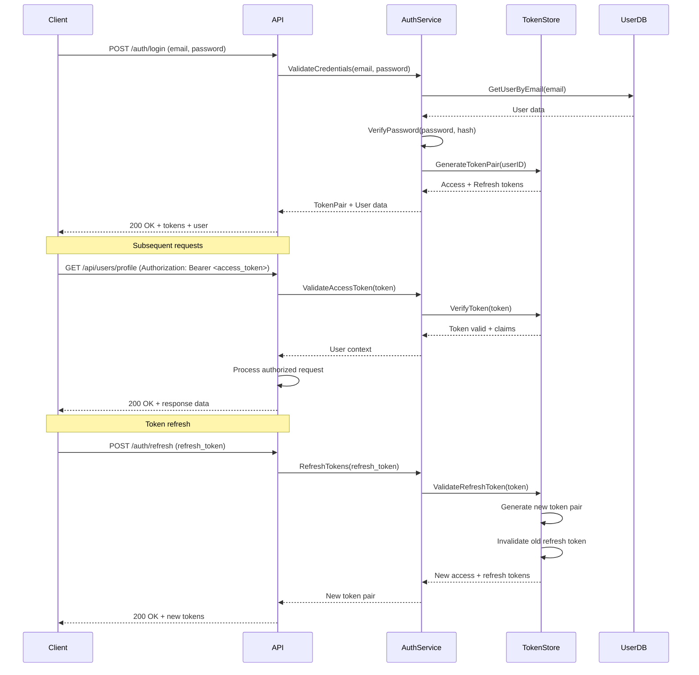

# Authentication: System Overview

This document defines the authentication and authorization strategy for [Your Project Name], establishing secure access patterns and session management for the entire application.

## Authentication Flow

The system uses JWT-based authentication with refresh token rotation, providing stateless authentication with secure token management.



## Token Strategy

### Access Tokens (JWT)
- **Lifetime**: 15 minutes
- **Purpose**: Authorization for API requests
- **Storage**: Client memory (not localStorage/sessionStorage)
- **Claims**: User ID, roles, permissions, expiration

```go
type AccessTokenClaims struct {
    UserID      string   `json:"user_id"`
    Email       string   `json:"email"`
    Roles       []string `json:"roles"`
    Permissions []string `json:"permissions"`
    jwt.RegisteredClaims
}

// Example access token generation
func (s *authService) generateAccessToken(user *User) (string, error) {
    claims := &AccessTokenClaims{
        UserID:      user.ID,
        Email:       user.Email,
        Roles:       user.Roles,
        Permissions: s.getPermissionsForRoles(user.Roles),
        RegisteredClaims: jwt.RegisteredClaims{
            ExpiresAt: jwt.NewNumericDate(time.Now().Add(15 * time.Minute)),
            IssuedAt:  jwt.NewNumericDate(time.Now()),
            Issuer:    s.config.JWTIssuer,
            Subject:   user.ID,
        },
    }
    
    token := jwt.NewWithClaims(jwt.SigningMethodHS256, claims)
    return token.SignedString([]byte(s.config.JWTSecret))
}
```

### Refresh Tokens
- **Lifetime**: 7 days
- **Purpose**: Generate new access tokens
- **Storage**: Secure HTTP-only cookie
- **Rotation**: New refresh token issued on each use

```go
type RefreshToken struct {
    ID        string    `db:"id"`
    UserID    string    `db:"user_id"`
    Token     string    `db:"token"`
    ExpiresAt time.Time `db:"expires_at"`
    CreatedAt time.Time `db:"created_at"`
    RevokedAt *time.Time `db:"revoked_at"`
}

func (s *authService) generateRefreshToken(userID string) (*RefreshToken, error) {
    tokenBytes := make([]byte, 32)
    if _, err := rand.Read(tokenBytes); err != nil {
        return nil, fmt.Errorf("generate random token: %w", err)
    }
    
    refreshToken := &RefreshToken{
        ID:        generateUUID(),
        UserID:    userID,
        Token:     base64.URLEncoding.EncodeToString(tokenBytes),
        ExpiresAt: time.Now().Add(7 * 24 * time.Hour),
        CreatedAt: time.Now(),
    }
    
    return s.tokenRepo.Create(context.Background(), refreshToken)
}
```

## Authorization Model

### Role-Based Access Control (RBAC)
The system implements RBAC with hierarchical roles and granular permissions.

```go
// User roles
const (
    RoleAdmin     = "admin"
    RoleModerator = "moderator"
    RoleUser      = "user"
)

// Permissions
const (
    PermissionUserRead   = "user:read"
    PermissionUserWrite  = "user:write"
    PermissionUserDelete = "user:delete"
    PermissionAdminPanel = "admin:panel"
)

// Role permission mapping
var rolePermissions = map[string][]string{
    RoleAdmin: {
        PermissionUserRead,
        PermissionUserWrite,
        PermissionUserDelete,
        PermissionAdminPanel,
    },
    RoleModerator: {
        PermissionUserRead,
        PermissionUserWrite,
    },
    RoleUser: {
        PermissionUserRead,
    },
}
```

### Permission Middleware
```go
func RequirePermission(permission string) func(http.Handler) http.Handler {
    return func(next http.Handler) http.Handler {
        return http.HandlerFunc(func(w http.ResponseWriter, r *http.Request) {
            // Get user context from previous auth middleware
            userCtx, ok := r.Context().Value("user").(*UserContext)
            if !ok {
                http.Error(w, "Unauthorized", http.StatusUnauthorized)
                return
            }
            
            // Check if user has required permission
            if !hasPermission(userCtx.Permissions, permission) {
                http.Error(w, "Forbidden", http.StatusForbidden)
                return
            }
            
            next.ServeHTTP(w, r)
        })
    }
}

func hasPermission(userPermissions []string, required string) bool {
    for _, perm := range userPermissions {
        if perm == required {
            return true
        }
    }
    return false
}
```

## Password Security

### Password Hashing
Using Argon2id for password hashing with recommended parameters.

```go
type PasswordHasher struct {
    memory      uint32
    iterations  uint32
    parallelism uint8
    saltLength  uint32
    keyLength   uint32
}

func NewPasswordHasher() *PasswordHasher {
    return &PasswordHasher{
        memory:      64 * 1024, // 64 MB
        iterations:  3,
        parallelism: 2,
        saltLength:  16,
        keyLength:   32,
    }
}

func (p *PasswordHasher) HashPassword(password string) (string, error) {
    salt := make([]byte, p.saltLength)
    if _, err := rand.Read(salt); err != nil {
        return "", err
    }
    
    hash := argon2.IDKey([]byte(password), salt, p.iterations, p.memory, p.parallelism, p.keyLength)
    
    // Format: $argon2id$v=19$m=65536,t=3,p=2$salt$hash
    encodedHash := fmt.Sprintf("$argon2id$v=%d$m=%d,t=%d,p=%d$%s$%s",
        argon2.Version, p.memory, p.iterations, p.parallelism,
        base64.RawStdEncoding.EncodeToString(salt),
        base64.RawStdEncoding.EncodeToString(hash))
    
    return encodedHash, nil
}

func (p *PasswordHasher) VerifyPassword(password, encodedHash string) (bool, error) {
    // Parse encoded hash to extract parameters and hash
    salt, hash, err := p.parseHash(encodedHash)
    if err != nil {
        return false, err
    }
    
    // Generate hash for provided password using same parameters
    otherHash := argon2.IDKey([]byte(password), salt, p.iterations, p.memory, p.parallelism, p.keyLength)
    
    // Use subtle.ConstantTimeCompare to prevent timing attacks
    return subtle.ConstantTimeCompare(hash, otherHash) == 1, nil
}
```

## Session Management

### User Context
```go
type UserContext struct {
    UserID      string    `json:"user_id"`
    Email       string    `json:"email"`
    Roles       []string  `json:"roles"`
    Permissions []string  `json:"permissions"`
    LastActive  time.Time `json:"last_active"`
}

// Middleware to extract user context from JWT
func AuthMiddleware(authService AuthService) func(http.Handler) http.Handler {
    return func(next http.Handler) http.Handler {
        return http.HandlerFunc(func(w http.ResponseWriter, r *http.Request) {
            authHeader := r.Header.Get("Authorization")
            if authHeader == "" {
                http.Error(w, "Missing authorization header", http.StatusUnauthorized)
                return
            }
            
            // Extract token from "Bearer <token>"
            parts := strings.Split(authHeader, " ")
            if len(parts) != 2 || parts[0] != "Bearer" {
                http.Error(w, "Invalid authorization header format", http.StatusUnauthorized)
                return
            }
            
            token := parts[1]
            claims, err := authService.ValidateAccessToken(token)
            if err != nil {
                http.Error(w, "Invalid token", http.StatusUnauthorized)
                return
            }
            
            userCtx := &UserContext{
                UserID:      claims.UserID,
                Email:       claims.Email,
                Roles:       claims.Roles,
                Permissions: claims.Permissions,
                LastActive:  time.Now(),
            }
            
            ctx := context.WithValue(r.Context(), "user", userCtx)
            next.ServeHTTP(w, r.WithContext(ctx))
        })
    }
}
```

## Decision History & Trade-offs

### JWT vs Session-Based Authentication
**Decision**: Use JWT-based authentication with refresh token rotation
**Rationale**:
- Stateless authentication enables horizontal scaling
- No server-side session storage required
- Claims embedded in token reduce database lookups
- Refresh token rotation provides security without UX impact

**Trade-offs**:
- Token revocation requires additional infrastructure (blacklist)
- Larger request overhead due to token size
- More complex client-side token management
- Difficulty updating user permissions without token refresh

### Argon2id for Password Hashing
**Decision**: Use Argon2id instead of bcrypt or scrypt
**Rationale**:
- Winner of Password Hashing Competition
- Resistant to GPU and ASIC attacks
- Configurable memory hardness and time complexity
- Industry standard for new applications

**Trade-offs**:
- Higher memory usage compared to bcrypt
- More complex parameter tuning
- Less widespread tooling support
- Higher computational cost (but provides better security)

### Role-Based Access Control
**Decision**: Implement RBAC instead of Attribute-Based Access Control (ABAC)
**Rationale**:
- Simpler to understand and implement
- Sufficient granularity for current requirements
- Clear role hierarchy and permissions
- Easy to audit and maintain

**Trade-offs**:
- Less flexible for complex authorization scenarios
- Role explosion risk as system grows
- Difficulty with context-dependent permissions
- Limited support for resource-specific permissions

### Refresh Token Rotation
**Decision**: Rotate refresh tokens on each use
**Rationale**:
- Limits impact of token compromise
- Enables detection of token reuse attacks
- Maintains security without impacting user experience
- Industry best practice for OAuth2

**Trade-offs**:
- More complex token management logic
- Requires careful handling of concurrent requests
- Potential for legitimate users to be logged out on token reuse detection
- Additional database writes for token rotation

---

**Next**: Review [integration.md](./integration.md) for framework integration patterns and [security.md](./security.md) for comprehensive security measures.