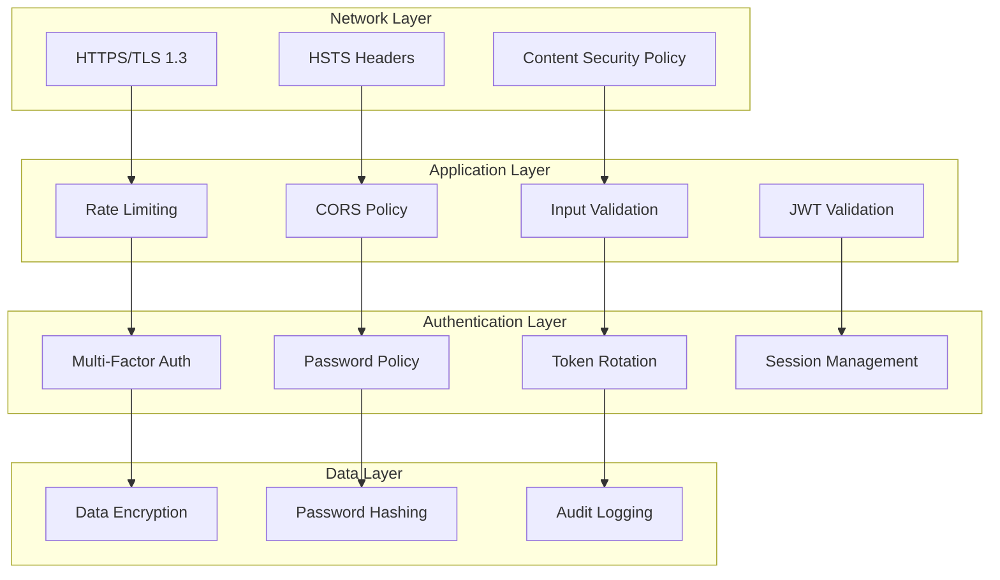

# Authentication: Security Model

This document defines the comprehensive security model for [Your Project Name], covering threat mitigation, security controls, and defensive measures for the authentication system.

## Security Architecture

### Defense in Depth Strategy
The authentication system implements multiple security layers to protect against various attack vectors:



## Threat Model

### Primary Threats
1. **Credential Compromise**: Stolen or weak passwords
2. **Token Theft**: Access token interception or XSS attacks
3. **Session Hijacking**: Session token compromise
4. **Brute Force Attacks**: Automated login attempts
5. **Privilege Escalation**: Unauthorized access to higher permissions
6. **Account Takeover**: Complete compromise of user accounts

### Attack Vectors
- Password-based attacks (brute force, dictionary, credential stuffing)
- Token-based attacks (theft, replay, manipulation)
- Session-based attacks (fixation, hijacking, CSRF)
- Injection attacks (SQL injection, XSS, header injection)
- Social engineering and phishing

## Security Controls

### Password Security
```go
// Password policy enforcement
type PasswordPolicy struct {
    MinLength        int
    RequireUppercase bool
    RequireLowercase bool
    RequireNumbers   bool
    RequireSymbols   bool
    MaxAge          time.Duration
    PreventReuse    int // Prevent reusing last N passwords
}

func NewPasswordPolicy() *PasswordPolicy {
    return &PasswordPolicy{
        MinLength:        12,
        RequireUppercase: true,
        RequireLowercase: true,
        RequireNumbers:   true,
        RequireSymbols:   true,
        MaxAge:          90 * 24 * time.Hour, // 90 days
        PreventReuse:    5,
    }
}

func (p *PasswordPolicy) Validate(password string) error {
    if len(password) < p.MinLength {
        return &ValidationError{
            Code:    "password_too_short",
            Message: fmt.Sprintf("Password must be at least %d characters", p.MinLength),
        }
    }
    
    if p.RequireUppercase && !regexp.MustCompile(`[A-Z]`).MatchString(password) {
        return &ValidationError{
            Code:    "password_missing_uppercase",
            Message: "Password must contain at least one uppercase letter",
        }
    }
    
    if p.RequireLowercase && !regexp.MustCompile(`[a-z]`).MatchString(password) {
        return &ValidationError{
            Code:    "password_missing_lowercase",
            Message: "Password must contain at least one lowercase letter",
        }
    }
    
    if p.RequireNumbers && !regexp.MustCompile(`\d`).MatchString(password) {
        return &ValidationError{
            Code:    "password_missing_numbers",
            Message: "Password must contain at least one number",
        }
    }
    
    if p.RequireSymbols && !regexp.MustCompile(`[!@#$%^&*()_+\-=\[\]{};':"\\|,.<>\/?]`).MatchString(password) {
        return &ValidationError{
            Code:    "password_missing_symbols",
            Message: "Password must contain at least one special character",
        }
    }
    
    return nil
}

// Check against common passwords
func (p *PasswordPolicy) IsCommonPassword(password string) bool {
    // Implementation would check against common password lists
    // For example, check against top 10k most common passwords
    commonPasswords := []string{
        "password", "123456", "password123", "admin", "qwerty",
        // ... more common passwords
    }
    
    for _, common := range commonPasswords {
        if strings.EqualFold(password, common) {
            return true
        }
    }
    
    return false
}
```

### Rate Limiting
```go
// Rate limiter for authentication endpoints
type AuthRateLimiter struct {
    loginAttempts     *rate.Limiter
    refreshAttempts   *rate.Limiter
    passwordResets    *rate.Limiter
    accountLockout    map[string]*AccountLockout
    lockoutMutex      sync.RWMutex
}

type AccountLockout struct {
    FailedAttempts int
    LockedUntil    time.Time
    LastAttempt    time.Time
}

func NewAuthRateLimiter() *AuthRateLimiter {
    return &AuthRateLimiter{
        // Allow 5 login attempts per minute per IP
        loginAttempts:   rate.NewLimiter(rate.Every(time.Minute/5), 5),
        // Allow 10 refresh requests per minute per IP
        refreshAttempts: rate.NewLimiter(rate.Every(time.Minute/10), 10),
        // Allow 3 password reset requests per hour per IP
        passwordResets:  rate.NewLimiter(rate.Every(time.Hour/3), 3),
        accountLockout:  make(map[string]*AccountLockout),
    }
}

func (rl *AuthRateLimiter) AllowLogin(ip, email string) error {
    // Check IP-based rate limiting
    if !rl.loginAttempts.Allow() {
        return &RateLimitError{
            Code:    "ip_rate_limit_exceeded",
            Message: "Too many login attempts from this IP address",
            RetryAfter: time.Minute,
        }
    }
    
    // Check account-based lockout
    rl.lockoutMutex.RLock()
    lockout, exists := rl.accountLockout[email]
    rl.lockoutMutex.RUnlock()
    
    if exists && time.Now().Before(lockout.LockedUntil) {
        return &RateLimitError{
            Code:    "account_locked",
            Message: "Account temporarily locked due to too many failed attempts",
            RetryAfter: time.Until(lockout.LockedUntil),
        }
    }
    
    return nil
}

func (rl *AuthRateLimiter) RecordFailedAttempt(email string) {
    rl.lockoutMutex.Lock()
    defer rl.lockoutMutex.Unlock()
    
    lockout, exists := rl.accountLockout[email]
    if !exists {
        lockout = &AccountLockout{}
        rl.accountLockout[email] = lockout
    }
    
    lockout.FailedAttempts++
    lockout.LastAttempt = time.Now()
    
    // Progressive lockout: 5 attempts = 15 min, 10 attempts = 1 hour
    if lockout.FailedAttempts >= 10 {
        lockout.LockedUntil = time.Now().Add(time.Hour)
    } else if lockout.FailedAttempts >= 5 {
        lockout.LockedUntil = time.Now().Add(15 * time.Minute)
    }
}

func (rl *AuthRateLimiter) RecordSuccessfulAttempt(email string) {
    rl.lockoutMutex.Lock()
    defer rl.lockoutMutex.Unlock()
    
    delete(rl.accountLockout, email)
}
```

### Token Security
```go
// Secure token generation and validation
type TokenManager struct {
    jwtSecret     []byte
    tokenBlacklist map[string]time.Time
    blacklistMutex sync.RWMutex
}

func NewTokenManager(secret []byte) *TokenManager {
    return &TokenManager{
        jwtSecret:      secret,
        tokenBlacklist: make(map[string]time.Time),
    }
}

// Generate cryptographically secure random tokens
func (tm *TokenManager) GenerateSecureToken() (string, error) {
    bytes := make([]byte, 32)
    if _, err := rand.Read(bytes); err != nil {
        return "", fmt.Errorf("generate secure token: %w", err)
    }
    
    return base64.URLEncoding.EncodeToString(bytes), nil
}

// Validate JWT token with security checks
func (tm *TokenManager) ValidateJWT(tokenString string) (*Claims, error) {
    // Parse token
    token, err := jwt.ParseWithClaims(tokenString, &Claims{}, func(token *jwt.Token) (interface{}, error) {
        // Validate signing method
        if _, ok := token.Method.(*jwt.SigningMethodHMAC); !ok {
            return nil, fmt.Errorf("unexpected signing method: %v", token.Header["alg"])
        }
        return tm.jwtSecret, nil
    })
    
    if err != nil {
        return nil, fmt.Errorf("parse token: %w", err)
    }
    
    claims, ok := token.Claims.(*Claims)
    if !ok || !token.Valid {
        return nil, errors.New("invalid token claims")
    }
    
    // Check if token is blacklisted
    if tm.IsTokenBlacklisted(claims.ID) {
        return nil, errors.New("token has been revoked")
    }
    
    // Additional security validations
    if err := tm.validateTokenClaims(claims); err != nil {
        return nil, fmt.Errorf("token validation failed: %w", err)
    }
    
    return claims, nil
}

func (tm *TokenManager) validateTokenClaims(claims *Claims) error {
    now := time.Now()
    
    // Check expiration with clock skew tolerance
    if claims.ExpiresAt.Time.Add(-30*time.Second).Before(now) {
        return errors.New("token expired")
    }
    
    // Check not before
    if claims.NotBefore.Time.After(now.Add(30*time.Second)) {
        return errors.New("token not valid yet")
    }
    
    // Check issued at (prevent tokens from future)
    if claims.IssuedAt.Time.After(now.Add(30*time.Second)) {
        return errors.New("token issued in future")
    }
    
    // Validate issuer
    if claims.Issuer != expectedIssuer {
        return errors.New("invalid token issuer")
    }
    
    return nil
}

// Blacklist token for revocation
func (tm *TokenManager) BlacklistToken(tokenID string, expiry time.Time) {
    tm.blacklistMutex.Lock()
    defer tm.blacklistMutex.Unlock()
    
    tm.tokenBlacklist[tokenID] = expiry
}

func (tm *TokenManager) IsTokenBlacklisted(tokenID string) bool {
    tm.blacklistMutex.RLock()
    defer tm.blacklistMutex.RUnlock()
    
    expiry, exists := tm.tokenBlacklist[tokenID]
    if !exists {
        return false
    }
    
    // Remove expired entries
    if time.Now().After(expiry) {
        delete(tm.tokenBlacklist, tokenID)
        return false
    }
    
    return true
}
```

### Input Sanitization
```go
// Input sanitizer for auth-related requests
type AuthInputSanitizer struct {
    emailRegex *regexp.Regexp
}

func NewAuthInputSanitizer() *AuthInputSanitizer {
    return &AuthInputSanitizer{
        emailRegex: regexp.MustCompile(`^[a-zA-Z0-9._%+-]+@[a-zA-Z0-9.-]+\.[a-zA-Z]{2,}$`),
    }
}

func (s *AuthInputSanitizer) SanitizeEmail(email string) (string, error) {
    // Normalize email
    email = strings.ToLower(strings.TrimSpace(email))
    
    // Validate format
    if !s.emailRegex.MatchString(email) {
        return "", &ValidationError{
            Code:    "invalid_email_format",
            Message: "Invalid email format",
        }
    }
    
    // Check length limits
    if len(email) > 254 {
        return "", &ValidationError{
            Code:    "email_too_long",
            Message: "Email address too long",
        }
    }
    
    // Additional security checks
    if strings.Contains(email, "..") {
        return "", &ValidationError{
            Code:    "invalid_email_format",
            Message: "Invalid email format",
        }
    }
    
    return email, nil
}

func (s *AuthInputSanitizer) SanitizeName(name string) (string, error) {
    // Trim whitespace
    name = strings.TrimSpace(name)
    
    // Check length
    if len(name) < 1 || len(name) > 100 {
        return "", &ValidationError{
            Code:    "invalid_name_length",
            Message: "Name must be between 1 and 100 characters",
        }
    }
    
    // Remove potentially dangerous characters
    name = regexp.MustCompile(`[<>\"'&]`).ReplaceAllString(name, "")
    
    return name, nil
}
```

## Security Headers

### HTTP Security Headers
```go
func securityHeaders(next http.Handler) http.Handler {
    return http.HandlerFunc(func(w http.ResponseWriter, r *http.Request) {
        // Prevent XSS attacks
        w.Header().Set("X-Content-Type-Options", "nosniff")
        w.Header().Set("X-Frame-Options", "DENY")
        w.Header().Set("X-XSS-Protection", "1; mode=block")
        
        // Content Security Policy
        csp := "default-src 'self'; " +
               "script-src 'self' 'unsafe-inline'; " +
               "style-src 'self' 'unsafe-inline'; " +
               "img-src 'self' data:; " +
               "font-src 'self'; " +
               "connect-src 'self'; " +
               "frame-ancestors 'none'"
        w.Header().Set("Content-Security-Policy", csp)
        
        // HSTS for HTTPS
        if r.TLS != nil {
            w.Header().Set("Strict-Transport-Security", "max-age=31536000; includeSubDomains; preload")
        }
        
        // Prevent referrer leakage
        w.Header().Set("Referrer-Policy", "strict-origin-when-cross-origin")
        
        // Permission policy
        w.Header().Set("Permissions-Policy", "geolocation=(), microphone=(), camera=()")
        
        next.ServeHTTP(w, r)
    })
}
```

## Audit Logging

### Security Event Logging
```go
type SecurityEvent struct {
    EventType   string                 `json:"event_type"`
    UserID      string                 `json:"user_id,omitempty"`
    Email       string                 `json:"email,omitempty"`
    IPAddress   string                 `json:"ip_address"`
    UserAgent   string                 `json:"user_agent"`
    Success     bool                   `json:"success"`
    Reason      string                 `json:"reason,omitempty"`
    Metadata    map[string]interface{} `json:"metadata,omitempty"`
    Timestamp   time.Time              `json:"timestamp"`
}

type SecurityLogger struct {
    logger Logger
}

func NewSecurityLogger(logger Logger) *SecurityLogger {
    return &SecurityLogger{
        logger: logger.WithComponent("security"),
    }
}

func (sl *SecurityLogger) LogAuthenticationAttempt(r *http.Request, email string, success bool, reason string) {
    event := SecurityEvent{
        EventType: "authentication_attempt",
        Email:     email,
        IPAddress: getClientIP(r),
        UserAgent: r.UserAgent(),
        Success:   success,
        Reason:    reason,
        Timestamp: time.Now(),
    }
    
    if success {
        sl.logger.Info("Authentication successful", "event", event)
    } else {
        sl.logger.Warn("Authentication failed", "event", event)
    }
}

func (sl *SecurityLogger) LogTokenRefresh(r *http.Request, userID string, success bool, reason string) {
    event := SecurityEvent{
        EventType: "token_refresh",
        UserID:    userID,
        IPAddress: getClientIP(r),
        UserAgent: r.UserAgent(),
        Success:   success,
        Reason:    reason,
        Timestamp: time.Now(),
    }
    
    sl.logger.Info("Token refresh attempt", "event", event)
}

func (sl *SecurityLogger) LogSuspiciousActivity(r *http.Request, userID, activity string, metadata map[string]interface{}) {
    event := SecurityEvent{
        EventType: "suspicious_activity",
        UserID:    userID,
        IPAddress: getClientIP(r),
        UserAgent: r.UserAgent(),
        Success:   false,
        Reason:    activity,
        Metadata:  metadata,
        Timestamp: time.Now(),
    }
    
    sl.logger.Error("Suspicious activity detected", "event", event)
}
```

## Decision History & Trade-offs

### Password Policy Strictness
**Decision**: Implement moderate password complexity requirements (12 chars, mixed case, numbers, symbols)
**Rationale**:
- Balance between security and usability
- Sufficient entropy to resist brute force attacks
- Alignment with current security standards (NIST guidelines)
- Prevents common password patterns

**Trade-offs**:
- May frustrate users with complex requirements
- Users might write down passwords if too complex
- Higher support burden for password resets
- Potential for user workarounds (incremental passwords)

### Token Blacklisting Strategy
**Decision**: Implement in-memory token blacklist with expiration cleanup
**Rationale**:
- Enables immediate token revocation for security incidents
- Fast lookup performance for token validation
- Simple implementation without external dependencies
- Automatic cleanup of expired blacklist entries

**Trade-offs**:
- Memory usage grows with revoked tokens
- Blacklist lost on application restart (mitigated by short token lifetimes)
- Not suitable for distributed deployments without shared storage
- Potential for memory leaks if cleanup fails

### Progressive Account Lockout
**Decision**: Implement progressive lockout periods based on failed attempt count
**Rationale**:
- Balances security against legitimate user lockouts
- Escalating penalties deter persistent attackers
- Allows recovery for occasional mistyped passwords
- Industry standard approach for brute force protection

**Trade-offs**:
- Complex logic to implement and maintain
- Potential for denial of service attacks against specific accounts
- Requires careful tuning to avoid user frustration
- Memory overhead for tracking failed attempts

### Comprehensive Audit Logging
**Decision**: Log all authentication events with detailed context
**Rationale**:
- Essential for security incident investigation
- Compliance requirements for many industries
- Enables detection of attack patterns
- Provides data for security metrics and alerting

**Trade-offs**:
- High volume of log data requires storage and management
- Performance impact of logging operations
- Privacy concerns with storing user activity
- Potential for log injection attacks if not sanitized

---

This completes the authentication domain documentation. The security model provides comprehensive protection against common attack vectors while maintaining usability and performance.