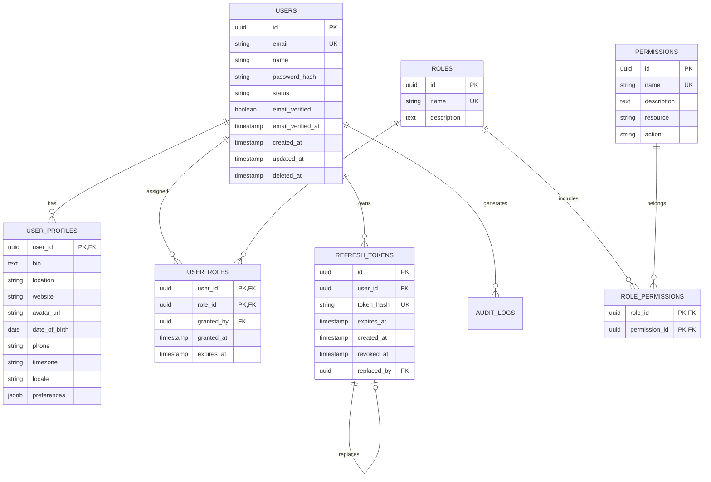

# Database: Schema Design

This document defines the database schema for [Your Project Name], including table structures, relationships, indexing strategies, and data integrity constraints.

## Database Overview

### Technology Stack
- **Database**: PostgreSQL 14+
- **Connection Pool**: pgpool-II or PgBouncer
- **Migrations**: Custom migration system or migrate tool
- **Backup Strategy**: Continuous WAL archiving + daily snapshots

### Schema Organization
```sql
-- Schema structure
CREATE SCHEMA IF NOT EXISTS app;        -- Application tables
CREATE SCHEMA IF NOT EXISTS auth;       -- Authentication tables  
CREATE SCHEMA IF NOT EXISTS audit;      -- Audit logging tables
CREATE SCHEMA IF NOT EXISTS config;     -- Configuration tables
```

## Core Tables

### Users Table
Central user management with role-based access control.

```sql
CREATE TABLE app.users (
    id UUID PRIMARY KEY DEFAULT gen_random_uuid(),
    email VARCHAR(255) NOT NULL UNIQUE,
    name VARCHAR(255) NOT NULL,
    password_hash VARCHAR(255) NOT NULL,
    status VARCHAR(50) NOT NULL DEFAULT 'active' 
        CHECK (status IN ('active', 'inactive', 'suspended')),
    email_verified BOOLEAN NOT NULL DEFAULT FALSE,
    email_verified_at TIMESTAMP,
    created_at TIMESTAMP NOT NULL DEFAULT CURRENT_TIMESTAMP,
    updated_at TIMESTAMP NOT NULL DEFAULT CURRENT_TIMESTAMP,
    deleted_at TIMESTAMP,
    
    CONSTRAINT users_email_valid 
        CHECK (email ~* '^[A-Za-z0-9._%+-]+@[A-Za-z0-9.-]+\.[A-Za-z]{2,}$')
);

-- Indexes
CREATE INDEX idx_users_email ON app.users(email) WHERE deleted_at IS NULL;
CREATE INDEX idx_users_status ON app.users(status) WHERE deleted_at IS NULL;
CREATE INDEX idx_users_created_at ON app.users(created_at);
CREATE UNIQUE INDEX idx_users_email_unique ON app.users(email) WHERE deleted_at IS NULL;

-- Updated timestamp trigger
CREATE OR REPLACE FUNCTION update_updated_at_column()
RETURNS TRIGGER AS $$
BEGIN
    NEW.updated_at = CURRENT_TIMESTAMP;
    RETURN NEW;
END;
$$ language 'plpgsql';

CREATE TRIGGER update_users_updated_at 
    BEFORE UPDATE ON app.users 
    FOR EACH ROW EXECUTE FUNCTION update_updated_at_column();
```

### User Profiles Table
Extended user information separated for performance.

```sql
CREATE TABLE app.user_profiles (
    user_id UUID PRIMARY KEY REFERENCES app.users(id) ON DELETE CASCADE,
    bio TEXT,
    location VARCHAR(255),
    website VARCHAR(255),
    avatar_url VARCHAR(500),
    date_of_birth DATE,
    phone VARCHAR(20),
    timezone VARCHAR(50) DEFAULT 'UTC',
    locale VARCHAR(10) DEFAULT 'en',
    preferences JSONB DEFAULT '{}',
    created_at TIMESTAMP NOT NULL DEFAULT CURRENT_TIMESTAMP,
    updated_at TIMESTAMP NOT NULL DEFAULT CURRENT_TIMESTAMP,
    
    CONSTRAINT user_profiles_website_valid 
        CHECK (website IS NULL OR website ~* '^https?://'),
    CONSTRAINT user_profiles_phone_valid
        CHECK (phone IS NULL OR phone ~ '^\+?[1-9]\d{1,14}$')
);

CREATE TRIGGER update_user_profiles_updated_at 
    BEFORE UPDATE ON app.user_profiles 
    FOR EACH ROW EXECUTE FUNCTION update_updated_at_column();

-- GIN index for JSONB preferences
CREATE INDEX idx_user_profiles_preferences ON app.user_profiles USING gin(preferences);
```

### User Roles and Permissions

```sql
-- Roles table
CREATE TABLE auth.roles (
    id UUID PRIMARY KEY DEFAULT gen_random_uuid(),
    name VARCHAR(50) NOT NULL UNIQUE,
    description TEXT,
    created_at TIMESTAMP NOT NULL DEFAULT CURRENT_TIMESTAMP
);

-- Permissions table
CREATE TABLE auth.permissions (
    id UUID PRIMARY KEY DEFAULT gen_random_uuid(),
    name VARCHAR(100) NOT NULL UNIQUE,
    description TEXT,
    resource VARCHAR(50) NOT NULL,
    action VARCHAR(50) NOT NULL,
    created_at TIMESTAMP NOT NULL DEFAULT CURRENT_TIMESTAMP,
    
    UNIQUE(resource, action)
);

-- User roles junction table
CREATE TABLE auth.user_roles (
    user_id UUID REFERENCES app.users(id) ON DELETE CASCADE,
    role_id UUID REFERENCES auth.roles(id) ON DELETE CASCADE,
    granted_by UUID REFERENCES app.users(id),
    granted_at TIMESTAMP NOT NULL DEFAULT CURRENT_TIMESTAMP,
    expires_at TIMESTAMP,
    
    PRIMARY KEY (user_id, role_id)
);

-- Role permissions junction table
CREATE TABLE auth.role_permissions (
    role_id UUID REFERENCES auth.roles(id) ON DELETE CASCADE,
    permission_id UUID REFERENCES auth.permissions(id) ON DELETE CASCADE,
    
    PRIMARY KEY (role_id, permission_id)
);

-- Indexes for efficient role/permission lookups
CREATE INDEX idx_user_roles_user_id ON auth.user_roles(user_id);
CREATE INDEX idx_user_roles_expires_at ON auth.user_roles(expires_at) WHERE expires_at IS NOT NULL;
CREATE INDEX idx_role_permissions_role_id ON auth.role_permissions(role_id);
```

### Authentication Tokens

```sql
CREATE TABLE auth.refresh_tokens (
    id UUID PRIMARY KEY DEFAULT gen_random_uuid(),
    user_id UUID NOT NULL REFERENCES app.users(id) ON DELETE CASCADE,
    token_hash VARCHAR(255) NOT NULL UNIQUE,
    expires_at TIMESTAMP NOT NULL,
    created_at TIMESTAMP NOT NULL DEFAULT CURRENT_TIMESTAMP,
    revoked_at TIMESTAMP,
    replaced_by UUID REFERENCES auth.refresh_tokens(id),
    
    -- Ensure token is not expired when not revoked
    CONSTRAINT refresh_tokens_valid_expiry 
        CHECK (revoked_at IS NOT NULL OR expires_at > CURRENT_TIMESTAMP)
);

-- Cleanup old tokens automatically
CREATE INDEX idx_refresh_tokens_user_id ON auth.refresh_tokens(user_id);
CREATE INDEX idx_refresh_tokens_expires_at ON auth.refresh_tokens(expires_at);
CREATE INDEX idx_refresh_tokens_revoked_at ON auth.refresh_tokens(revoked_at) WHERE revoked_at IS NOT NULL;

-- Token blacklist for immediate revocation
CREATE TABLE auth.token_blacklist (
    token_id VARCHAR(255) PRIMARY KEY,
    expires_at TIMESTAMP NOT NULL,
    revoked_at TIMESTAMP NOT NULL DEFAULT CURRENT_TIMESTAMP,
    reason VARCHAR(100)
);

-- Automatic cleanup of expired blacklisted tokens
CREATE INDEX idx_token_blacklist_expires_at ON auth.token_blacklist(expires_at);
```

## Database Relationships

### Entity Relationship Diagram



## Audit and Logging Schema

### Audit Logs Table
```sql
CREATE TABLE audit.logs (
    id UUID PRIMARY KEY DEFAULT gen_random_uuid(),
    user_id UUID REFERENCES app.users(id),
    action VARCHAR(100) NOT NULL,
    resource_type VARCHAR(50) NOT NULL,
    resource_id VARCHAR(255),
    old_values JSONB,
    new_values JSONB,
    ip_address INET,
    user_agent TEXT,
    success BOOLEAN NOT NULL DEFAULT TRUE,
    error_message TEXT,
    metadata JSONB DEFAULT '{}',
    created_at TIMESTAMP NOT NULL DEFAULT CURRENT_TIMESTAMP
);

-- Partitioning by month for performance
CREATE TABLE audit.logs_y2024m01 PARTITION OF audit.logs
    FOR VALUES FROM ('2024-01-01') TO ('2024-02-01');

-- Indexes for audit queries
CREATE INDEX idx_audit_logs_user_id ON audit.logs(user_id, created_at);
CREATE INDEX idx_audit_logs_action ON audit.logs(action, created_at);
CREATE INDEX idx_audit_logs_resource ON audit.logs(resource_type, resource_id);
CREATE INDEX idx_audit_logs_created_at ON audit.logs(created_at);

-- GIN index for metadata searches
CREATE INDEX idx_audit_logs_metadata ON audit.logs USING gin(metadata);
```

### Rate Limiting Tables
```sql
CREATE TABLE config.rate_limits (
    id UUID PRIMARY KEY DEFAULT gen_random_uuid(),
    identifier VARCHAR(255) NOT NULL,  -- IP address, user ID, API key
    endpoint VARCHAR(255) NOT NULL,    -- Specific endpoint or global
    requests_count INTEGER NOT NULL DEFAULT 0,
    window_start TIMESTAMP NOT NULL,
    window_duration INTERVAL NOT NULL DEFAULT '1 hour',
    max_requests INTEGER NOT NULL,
    
    UNIQUE(identifier, endpoint, window_start)
);

-- TTL index for automatic cleanup
CREATE INDEX idx_rate_limits_window ON config.rate_limits(window_start);
CREATE INDEX idx_rate_limits_lookup ON config.rate_limits(identifier, endpoint);
```

## Data Types and Constraints

### Custom Types
```sql
-- User status enum
CREATE TYPE app.user_status AS ENUM ('active', 'inactive', 'suspended', 'deleted');

-- Audit action types
CREATE TYPE audit.action_type AS ENUM (
    'create', 'read', 'update', 'delete',
    'login', 'logout', 'password_change',
    'role_grant', 'role_revoke', 'permission_grant', 'permission_revoke'
);

-- Token types
CREATE TYPE auth.token_type AS ENUM ('access', 'refresh', 'reset', 'verification');
```

### Data Validation Functions
```sql
-- Email validation function
CREATE OR REPLACE FUNCTION validate_email(email TEXT) RETURNS BOOLEAN AS $$
BEGIN
    RETURN email ~* '^[A-Za-z0-9._%+-]+@[A-Za-z0-9.-]+\.[A-Za-z]{2,}$' 
           AND length(email) <= 255;
END;
$$ LANGUAGE plpgsql IMMUTABLE;

-- Password strength validation
CREATE OR REPLACE FUNCTION validate_password_strength(password TEXT) RETURNS BOOLEAN AS $$
BEGIN
    RETURN length(password) >= 12
           AND password ~ '[A-Z]'    -- uppercase
           AND password ~ '[a-z]'    -- lowercase  
           AND password ~ '[0-9]'    -- number
           AND password ~ '[^A-Za-z0-9]'; -- special char
END;
$$ LANGUAGE plpgsql IMMUTABLE;

-- Phone number validation
CREATE OR REPLACE FUNCTION validate_phone(phone TEXT) RETURNS BOOLEAN AS $$
BEGIN
    RETURN phone ~ '^\+?[1-9]\d{1,14}$' AND length(phone) BETWEEN 7 AND 15;
END;
$$ LANGUAGE plpgsql IMMUTABLE;
```

## Performance Optimization

### Indexing Strategy
```sql
-- Composite indexes for common query patterns
CREATE INDEX idx_users_status_created ON app.users(status, created_at) 
    WHERE deleted_at IS NULL;

CREATE INDEX idx_users_email_status ON app.users(email, status) 
    WHERE deleted_at IS NULL;

-- Partial indexes for soft deletes
CREATE INDEX idx_users_active ON app.users(created_at) 
    WHERE status = 'active' AND deleted_at IS NULL;

-- Functional indexes
CREATE INDEX idx_users_email_lower ON app.users(lower(email)) 
    WHERE deleted_at IS NULL;

-- Expression indexes for JSONB
CREATE INDEX idx_user_profiles_pref_theme ON app.user_profiles((preferences->>'theme'));
```

### Query Performance Views
```sql
-- User permissions view for efficient authorization
CREATE VIEW auth.user_permissions AS
SELECT DISTINCT
    ur.user_id,
    p.name as permission,
    p.resource,
    p.action
FROM auth.user_roles ur
JOIN auth.role_permissions rp ON ur.role_id = rp.role_id
JOIN auth.permissions p ON rp.permission_id = p.id
WHERE (ur.expires_at IS NULL OR ur.expires_at > CURRENT_TIMESTAMP);

-- Materialized view for user stats (refresh periodically)
CREATE MATERIALIZED VIEW app.user_stats AS
SELECT 
    DATE_TRUNC('day', created_at) as date,
    COUNT(*) as new_users,
    COUNT(*) FILTER (WHERE email_verified = true) as verified_users
FROM app.users 
WHERE deleted_at IS NULL
GROUP BY DATE_TRUNC('day', created_at);

-- Refresh materialized view daily
CREATE INDEX idx_user_stats_date ON app.user_stats(date);
```

## Decision History & Trade-offs

### UUID vs Serial IDs
**Decision**: Use UUIDs for primary keys instead of serial integers
**Rationale**:
- Prevents ID enumeration attacks
- Enables distributed system scalability
- Better for API security (no predictable IDs)
- Supports database sharding and replication

**Trade-offs**:
- Larger storage footprint (16 bytes vs 4-8 bytes)
- Slightly slower joins compared to integers
- Less human-readable in logs and debugging
- Random UUID insertion can cause index fragmentation

### Soft Deletes Implementation
**Decision**: Use `deleted_at` timestamp for soft deletes instead of boolean flag
**Rationale**:
- Preserves deletion timestamp for audit purposes
- Allows multiple soft delete/restore cycles
- Easier to implement time-based cleanup policies
- Standard pattern across many ORMs

**Trade-offs**:
- All queries must include `WHERE deleted_at IS NULL` filter
- Unique constraints become more complex
- Additional storage for deleted records
- Risk of forgotten soft delete filters causing bugs

### JSONB for Flexible Data
**Decision**: Use JSONB for user preferences and metadata storage
**Rationale**:
- Flexible schema for varying user preferences
- Native PostgreSQL JSON support with indexing
- Avoids EAV (Entity-Attribute-Value) anti-pattern
- Efficient storage and querying

**Trade-offs**:
- Less strict data validation compared to normalized tables
- Potential for inconsistent data structure
- Complex queries for nested JSON operations
- Migration challenges when JSON structure changes

### Audit Table Partitioning
**Decision**: Partition audit logs by month for better performance
**Rationale**:
- Large audit tables benefit from partitioning
- Monthly partitions enable efficient data archival
- Query performance improves with partition pruning
- Easier maintenance operations on individual partitions

**Trade-offs**:
- Complex partition management and maintenance
- Queries spanning multiple partitions may be slower
- Additional complexity in application code
- Requires careful planning for partition boundaries

### Role-Permission Junction Tables
**Decision**: Separate tables for user-roles and role-permissions relationships
**Rationale**:
- Flexible RBAC implementation
- Supports role hierarchy and inheritance
- Efficient permission checking queries
- Standard security pattern

**Trade-offs**:
- More complex queries for permission checking
- Additional storage overhead with junction tables
- Potential for inconsistent role assignments
- More complex user interface for role management

---

**Next**: Review [models.md](./models.md) for data model implementations and [migrations.md](./migrations.md) for schema change management.